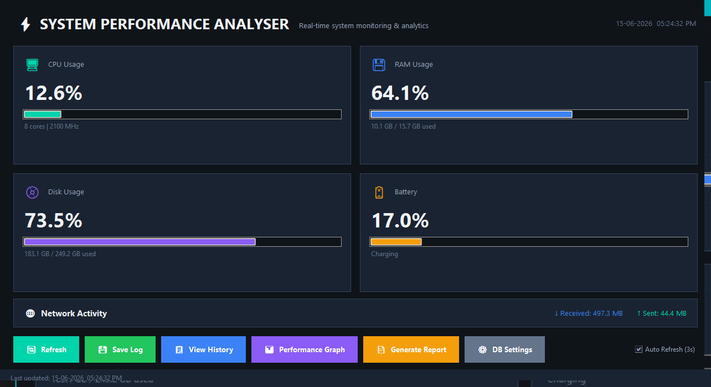
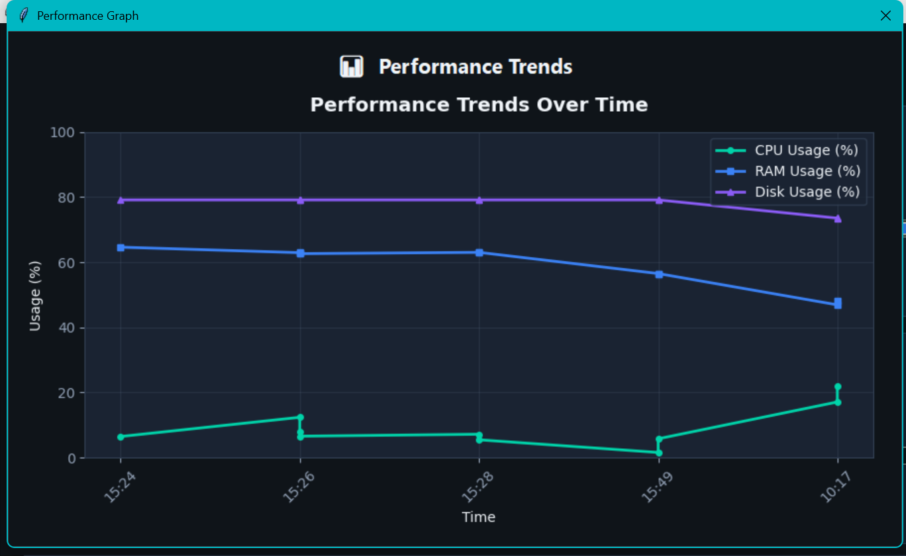
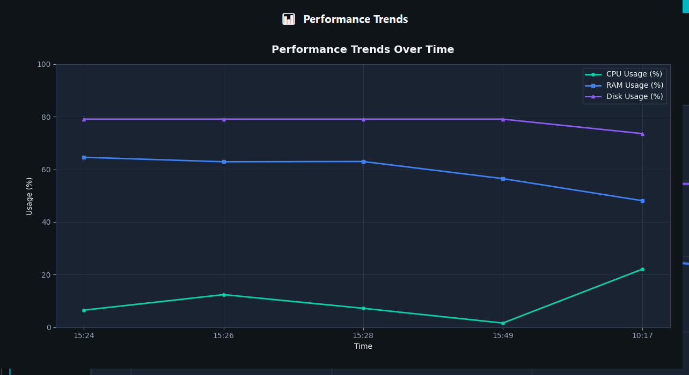
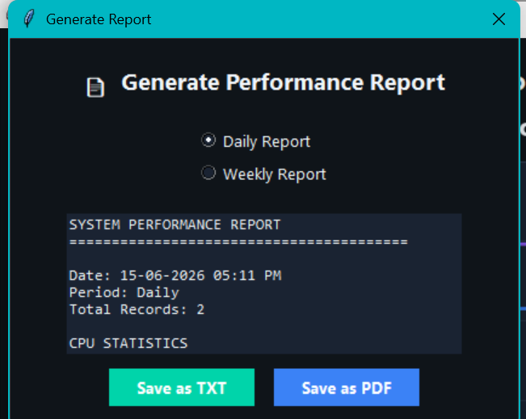

# System Performance Analyser

A desktop-based system monitoring application built with **Python**, **Tkinter**, **MySQL**, **psutil**, and **Matplotlib**. It collects real-time system metrics (CPU, RAM, Disk, Battery, Network), stores them in a MySQL database, and provides historical analysis, graphs, and reports through a modern GUI.


## Features

- **Real-Time Monitoring** — Live CPU, RAM, Disk, Battery, and Network stats
- **Auto Refresh** — Dashboard updates every 3 seconds automatically
- **Save Logs** — Store performance snapshots in MySQL database
- **View History** — Browse all saved performance records in a table
- **Performance Graphs** — Visualize CPU, RAM, and Disk trends with Matplotlib
- **Report Generation** — Daily/Weekly reports exported as TXT or PDF
- **Modern Dark UI** — Professional card-based dashboard design

## Screenshots









## Tech Stack

| Component | Technology |
|-----------|------------|
| Language | Python 3.8+ |
| GUI | Tkinter |
| Database | MySQL |
| Monitoring | psutil |
| Graphs | Matplotlib |
| Reports | fpdf2 |

## Project Structure

```
system-performance-analyser/
├── main.py           # GUI application (entry point)
├── monitor.py        # System metrics collection (psutil)
├── database.py       # MySQL connection & queries
├── report.py         # TXT/PDF report generation
├── graphs.py         # Matplotlib visualizations
├── config.py         # Database & UI configuration
├── setup.sql         # Manual database setup script
├── requirements.txt  # Python dependencies
└── README.md
```

## Installation

### 1. Prerequisites

- Python 3.8 or higher
- MySQL Server 8.0+ (running locally)

### 2. Clone / Download

```bash
cd system-performance-analyser
```

### 3. Install Dependencies

```bash
pip install -r requirements.txt
```

### 4. Configure MySQL

Edit `config.py` and update your MySQL credentials:

```python
DB_CONFIG = {
    "host": "localhost",
    "port": 3306,
    "user": "root",
    "password": "your_password",   # <-- change this
    "database": "system_performance",
}
```

The database and table are created automatically on first run. You can also run `setup.sql` manually in MySQL Workbench.

### 5. Run the Application

```bash
python main.py
```

## Usage

1. **Launch** — Run `python main.py` to open the dashboard
2. **Refresh** — Click Refresh or enable Auto Refresh for live updates
3. **Save Log** — Click Save Log to store current metrics in MySQL
4. **View History** — Open the history window to see all saved records
5. **Graphs** — Click Performance Graph to visualize trends
6. **Reports** — Generate Daily/Weekly reports as TXT or PDF files (saved in `reports/` folder)

## Database Schema

```sql
CREATE TABLE performance_logs (
    id INT AUTO_INCREMENT PRIMARY KEY,
    log_time DATETIME NOT NULL,
    cpu_usage FLOAT NOT NULL,
    ram_usage FLOAT NOT NULL,
    disk_usage FLOAT NOT NULL,
    battery FLOAT DEFAULT NULL,
    bytes_sent BIGINT DEFAULT 0,
    bytes_received BIGINT DEFAULT 0
);
```

## Architecture

```
User → Tkinter GUI → Python Backend → psutil (live data)
                                    → MySQL (storage)
                                    → Matplotlib (graphs)
                                    → fpdf2 (reports)
```

## Resume Description

> Developed a System Performance Analyser using Python and MySQL that monitors CPU, RAM, Disk, Network, and Battery statistics in real-time. The system stores performance logs in a MySQL database, generates analytical reports, and visualizes system metrics using graphs for performance analysis.

## Author

Vishnu — Engineering Mini Project

## License

MIT License
